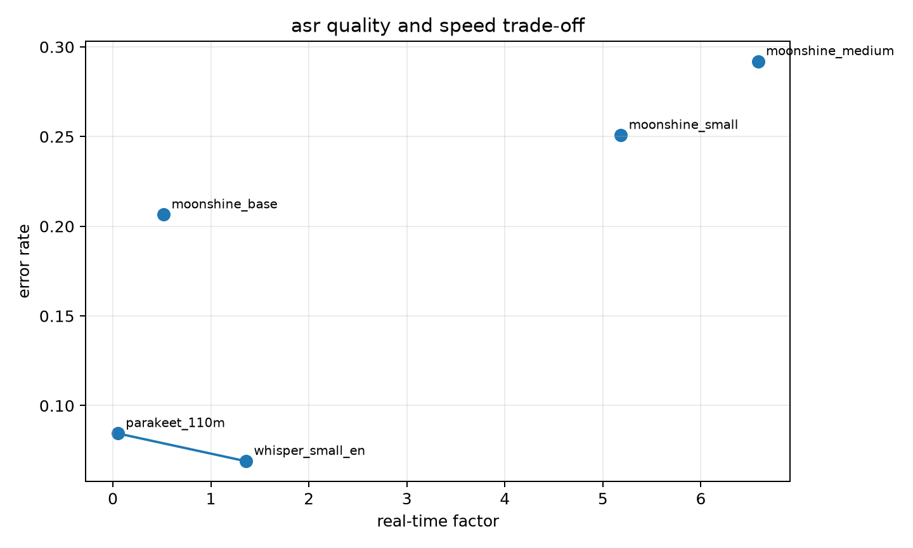
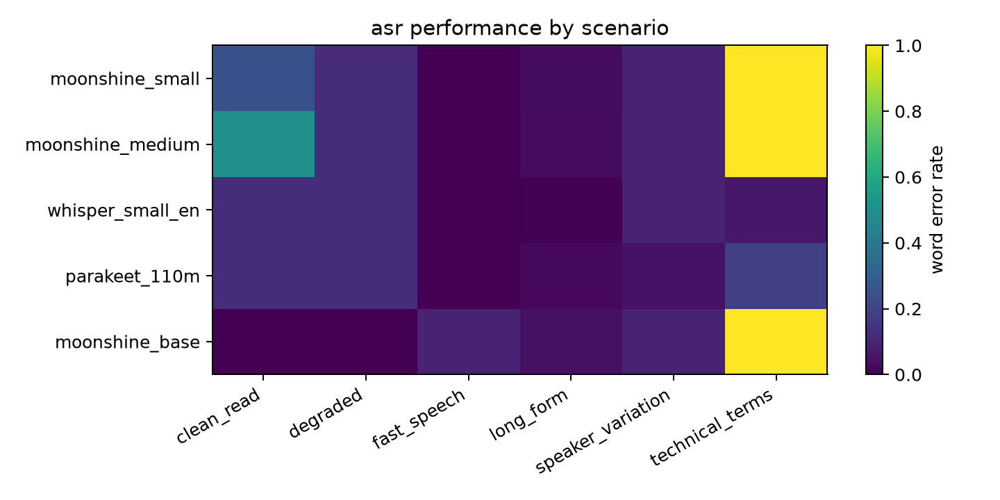
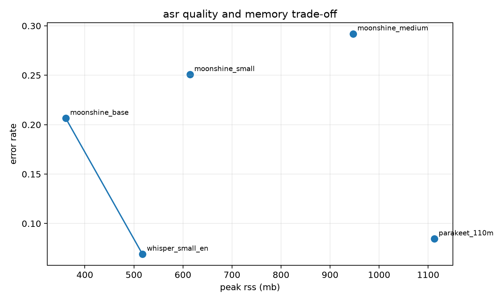
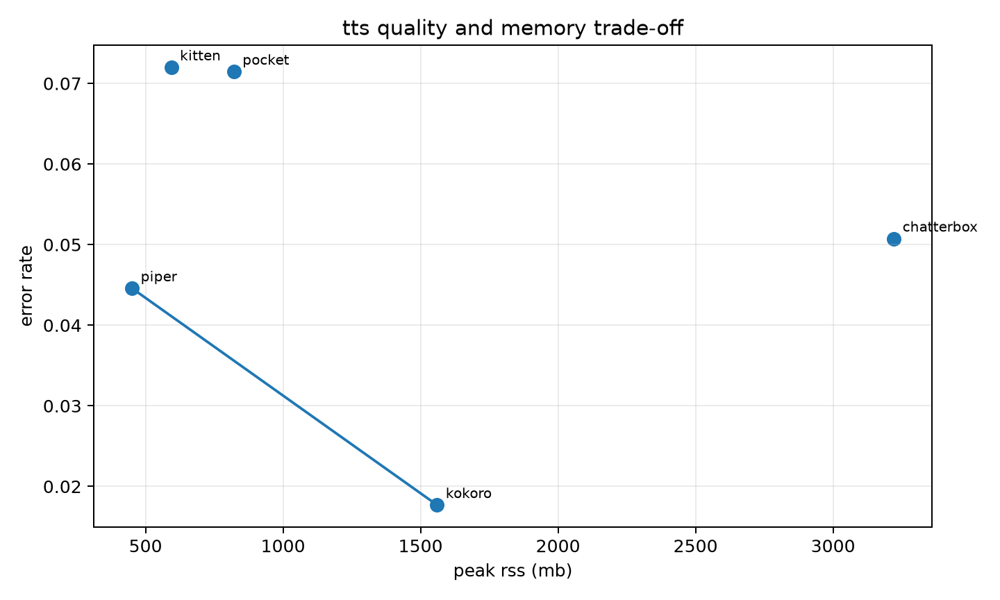
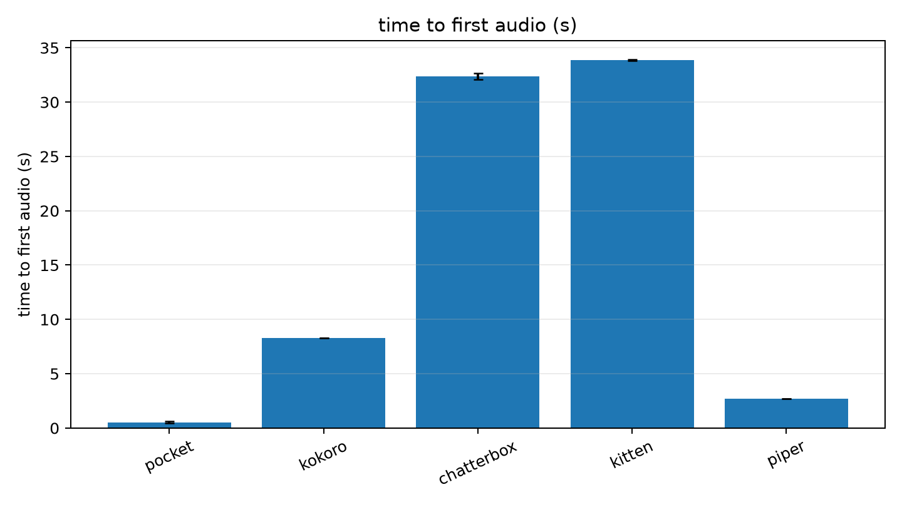
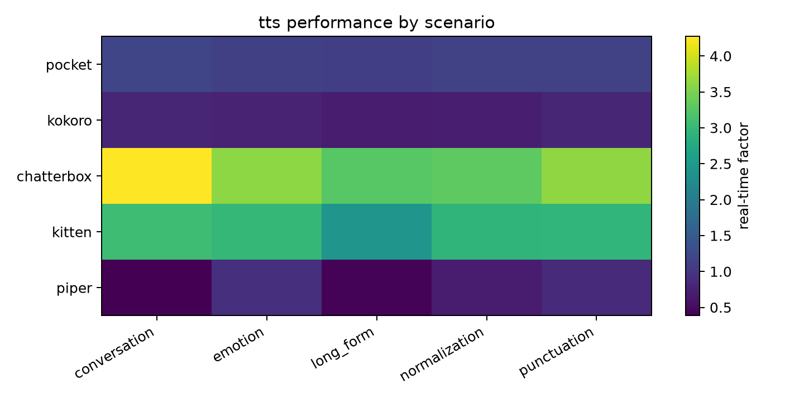

# conclusion

## winners

**asr: parakeet 110m**

parakeet recorded 0.084 wer, 0.05 rtf, 2.11 seconds mean processing time, and 8.94 cpu seconds. it was about 27 times faster than whisper by rtf. its long recording reached 1112.6 mb of ram, so it does not meet the 400 mb limit.

**tts: kokoro 82m**

kokoro scored 4.57 out of 5 in blind listening, recorded the lowest evaluator wer at 0.018, and generated faster than real time at 0.76 rtf. it reached 1559.9 mb of ram. chatterbox scored 4.63 in listening, but 3.65 rtf, 32.38 seconds to first audio, 3221.1 mb of ram, and 2860.1 mb on disk make it unsuitable for local cpu service.

the 400 mb limit changes both choices. moonshine base is the only asr model that stayed below it. no tts model did. piper came closest at 450.9 mb, but scored 2.23 in blind listening.

## asr

| model | wer | rtf | mean time | average ram | maximum ram | cpu time | disk |
|---|---:|---:|---:|---:|---:|---:|---:|
| parakeet 110m | 0.084 | 0.05 | 2.11 s | 426.9 mb | 1112.6 mb | 8.94 s | 225.3 mb |
| whisper small.en | 0.069 | 1.36 | 14.56 s | 418.7 mb | 517.5 mb | 61.52 s | 181.3 mb |
| moonshine base | 0.206 | 0.52 | 12.71 s | 268.2 mb | 361.1 mb | 79.31 s | 240.0 mb |
| moonshine v2 small streaming | 0.251 | 5.18 | 21.79 s | 482.8 mb | 614.2 mb | 1321.28 s | 236.3 mb |
| moonshine v2 medium streaming | 0.292 | 6.58 | 23.68 s | 773.1 mb | 946.8 mb | 1555.54 s | 430.2 mb |

whisper is the accuracy choice. it led the technical recording at 0.063 wer and the long recording at 0.006. parakeet scored 0.188 and 0.022 on those cases, with much lower latency and cpu cost. moonshine base fits the memory limit, but scored 1.0 wer on the technical recording. moonshine v2 small and medium were slower, less accurate, and larger in memory.

parakeet should use native segmentation. silero vad produced 1.0 wer for parakeet. whisper's vad output was correct but no faster. vad reduced work for moonshine. vad used only the clean and noisy recordings, so its aggregate cannot be compared with the six-recording native aggregate.

moonshine v2 small and medium returned native partial transcripts and timestamps. whisper returned timestamps and accepted prompts. parakeet returned punctuation and capitalization, but no partial transcript or timestamp through the tested runtime.

## tts

| model | evaluator wer | rtf | first audio | average ram | maximum ram | cpu time | disk |
|---|---:|---:|---:|---:|---:|---:|---:|
| kokoro 82m | 0.018 | 0.76 | 8.28 s | 1243.0 mb | 1559.9 mb | 48.47 s | 313.1 mb |
| piper | 0.045 | 0.61 | 2.70 s | 369.1 mb | 450.9 mb | 51.06 s | 108.6 mb |
| pocket tts | 0.071 | 1.15 | 0.52 s | 795.9 mb | 821.1 mb | 17.38 s | 220.9 mb |
| kittentts mini | 0.072 | 2.87 | 33.87 s | 557.9 mb | 593.4 mb | 226.40 s | 77.8 mb |
| chatterbox nano | 0.051 | 3.65 | 32.38 s | 2920.0 mb | 3221.1 mb | 108.43 s | 2860.1 mb |

evaluator wer is an intelligibility check from a common whisper transcription. it is not a naturalness score.

one listener rated six hidden clips per model on five 1-to-5 scales. overall is the equal mean of the five fields.

| model | overall | naturalness | intelligibility | prosody | appeal | artifact-free |
|---|---:|---:|---:|---:|---:|---:|
| chatterbox | 4.63 | 4.83 | 4.33 | 4.17 | 4.83 | 5.00 |
| kokoro | 4.57 | 4.33 | 4.50 | 4.50 | 4.50 | 5.00 |
| pocket | 4.17 | 4.33 | 3.83 | 4.00 | 4.17 | 4.50 |
| kitten | 3.33 | 3.33 | 3.17 | 3.17 | 2.83 | 4.17 |
| piper | 2.23 | 1.67 | 2.00 | 1.33 | 1.67 | 4.50 |

the 0.07-point gap between chatterbox and kokoro is too small for a firm quality distinction from one listener. kokoro wins after latency, ram, disk, and throughput are included.

pocket returned audio first at 0.52 seconds and supports native streaming, but used 821.1 mb and generated slower than real time. piper was fastest by total rtf and closest to the memory target. kitten and chatterbox were too slow for interactive use on this cpu. no generic output clipped.

kokoro passed voice, speed, and pronunciation controls. pocket passed streaming and built-in voice selection. its optional cloning weights were gated and were not tested. chatterbox passed cloning and paralinguistic tags. kitten passed voice, speed, and text-normalization controls. piper passed streaming, speed, noise, and phoneme-width controls.

## plot index

| plots | reading |
|---|---|
| `asr_wer`, `asr_cer`, `asr_scenario_heatmap` | whisper leads accuracy; technical speech breaks all moonshine variants |
| `asr_latency`, `asr_rtf`, `asr_cpu_time`, `asr_average_cpu` | parakeet leads speed and cpu efficiency |
| `asr_peak_ram`, `asr_average_ram`, `asr_disk_vs_peak_ram` | moonshine base alone stays below 400 mb; parakeet spikes on long audio |
| `asr_quality_per_mb`, `asr_quality_per_cpu_second` | whisper leads accuracy per model mb; parakeet leads accuracy per cpu second |
| `asr_deployment_score`, `asr_ranking_heatmap`, `asr_tradeoff_paths` | whisper leads balanced and quality scoring; parakeet leads latency; moonshine base leads within 400 mb |
| `tts_intelligibility_wer`, `tts_scenario_heatmap`, `tts_clipping` | kokoro leads automated intelligibility; piper and kokoro stay below 1 rtf; clipping is zero |
| `tts_first_audio`, `tts_rtf`, `tts_cpu_time`, `tts_average_cpu` | pocket starts first; piper finishes fastest |
| `tts_peak_ram`, `tts_average_ram`, `tts_disk_vs_peak_ram` | no model stays below 400 mb; piper is closest |
| `tts_quality_per_mb`, `tts_quality_per_cpu_second` | piper leads size efficiency; pocket uses little cpu after load |
| `tts_quality_speed_pareto`, `tts_quality_memory_pareto` | kokoro and piper form the useful performance frontier |
| `tts_deployment_score`, `tts_ranking_heatmap`, `tts_tradeoff_paths` | kokoro leads unconstrained quality; piper leads memory-first scoring |

## run conditions

windows 11, python 3.12.13, 12 physical cores, 16 logical cores, and 15.6 gb ram. each configuration ran in a fresh process. warmups were discarded. the controlled profile used four threads. short cases had three measured repetitions. active jobs recorded no failures.

wer, cer, rtf, time, ram, cpu time, and disk are lower-is-better. maximum ram is the largest process rss seen in any measured case. ranking weights are in `config/benchmark.json`.

## files

- [dashboard](outputs/review/index.html)
- [master result](outputs/master.json)
- [processed tables](outputs/processed)
- [blind audio](outputs/audio/blind)
- [human ratings](outputs/processed/human_ratings.csv)
- [human rating averages](outputs/processed/human_ratings_summary.csv)
